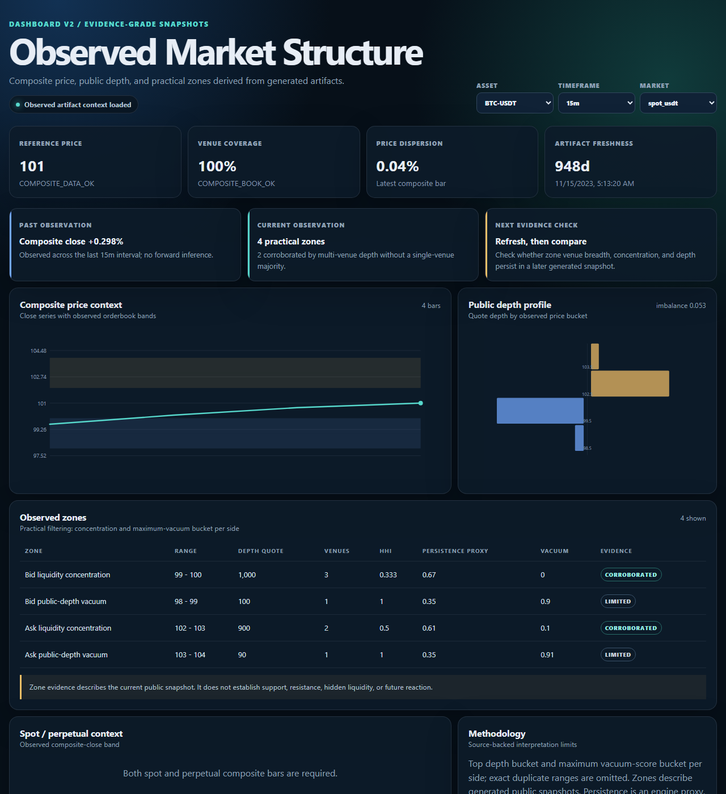

# Dashboard UI and API

The local dashboard is a read-only observed-market-structure viewer built on Python's standard-library HTTP server. It serves a static frontend and JSON endpoints from the same local origin.

## Start

```bash
crypto-composite dashboard --artifact-root artifacts-universe --host 127.0.0.1 --port 18080
```

Open `http://127.0.0.1:18080/` for the frontend.

## Static export

Embed the Dashboard V2 analytical snapshot and artifact index into a static HTML file:

```bash
crypto-composite dashboard-export \
  --artifact-root artifacts-universe \
  --out-file site/index.html \
  --artifact-base-url artifacts
```

The dashboard cards, charts, filters, zones, and methodology work without the local API. `--artifact-base-url` is optional and only enables JSON inspector links when the artifact files are published beside the HTML output.

## Screenshot



This screenshot is rendered from `examples/sample_artifacts`. The values are deterministic fixture data, not live market data.

## Endpoints

| Endpoint | Purpose |
|---|---|
| `/` | Dashboard V2 observed-market-structure frontend |
| `/api/health` | Service health check |
| `/api/artifacts` | List JSON artifact paths and byte sizes |
| `/api/dashboard-snapshot` | Build an artifact-derived view of composite bars, public depth, observed zones, and methodology |
| `/api/artifact?path=<relative-json-path>` | Read one JSON artifact by relative path |

## Health contract

`/api/health` returns the service identity and current status:

```json
{
  "service": "crypto-composite-dashboard",
  "status": "OK"
}
```

## Artifact index contract

`/api/artifacts` returns an object. Its `artifacts` field is an object list, not a string list:

```json
{
  "artifact_count": 2,
  "artifacts": [
    {
      "path": "BTC-USDT/data_quality.json",
      "size_bytes": 481
    },
    {
      "path": "universe_summary.json",
      "size_bytes": 902
    }
  ],
  "well_known": {
    "universe_summary.json": true
  }
}
```

Each artifact entry has exactly these public index fields:

- `path`: forward-slash relative path under the selected artifact root;
- `size_bytes`: current file size in bytes.

The object-list contract replaces the earlier string-list response. Consumers must read `entry.path` instead of treating each entry as a string.

## Frontend panels

The frontend reads the API at runtime and displays:

- asset, timeframe, and market-type filters;
- composite reference price, venue coverage, dispersion, and artifact freshness;
- observed past/current/next-evidence-check context;
- a composite close chart with observed public-depth bands;
- a public orderbook depth profile;
- practical concentration and maximum-vacuum zones;
- spot/perpetual composite-close dislocation context;
- artifact paths and sizes; and
- a read-only JSON inspector.

Dynamic artifact values are inserted as text, not executable HTML.

## Observed zone contract

The snapshot endpoint selects at most four practical buckets per market type:

- the existing `top_bid_wall` and `top_ask_wall` depth buckets;
- the maximum `vacuum_score` bucket on each side, excluding an exact duplicate of the selected wall.

Evidence grades evaluate source corroboration only:

| Grade | Exact rule |
|---|---|
| `CORROBORATED` | `COMPOSITE_BOOK_OK`, at least two contributing venues, and no venue supplies more than half of the bucket depth |
| `CONCENTRATED` | One venue supplies more than half of observed bucket depth |
| `LIMITED` | Book status is partial/weak or fewer than two venues contribute |

These grades do not estimate future price reaction. `persistence` and `spoof_risk_proxy` remain engine proxies. A single artifact snapshot cannot establish a zone lifecycle.

The spot/perpetual dislocation band uses the two latest composite closes. It is an observed difference, not a convergence forecast. Exact cross-venue disagreement bounds are not created because the current composite artifact exposes dispersion but not per-venue price bounds.

## Boundary

The dashboard does not produce trading signals, asset rankings, entry or exit instructions, order execution, position sizing, predictions, or financial advice. It does not claim hidden liquidity, market-maker intent, or future reaction. It only exposes generated public-data artifacts and evidence quality.

## Troubleshooting

On Windows, a local port can be unavailable because it is already bound, excluded, or blocked by local security policy. If dashboard startup returns `DASHBOARD_BIND_FAILED` or `WinError 10013`, retry with a different local port:

```bash
crypto-composite dashboard --artifact-root artifacts-universe --host 127.0.0.1 --port 18081
```

Do not stop an unrelated process. Changing the dashboard port does not change generated market-data artifacts.
